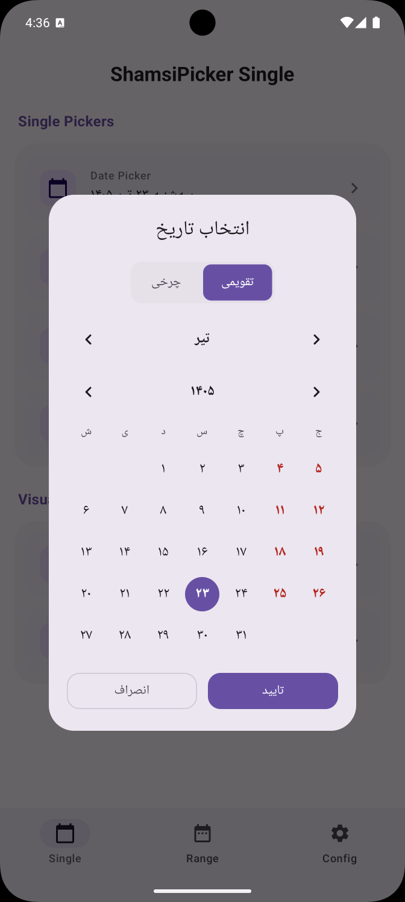
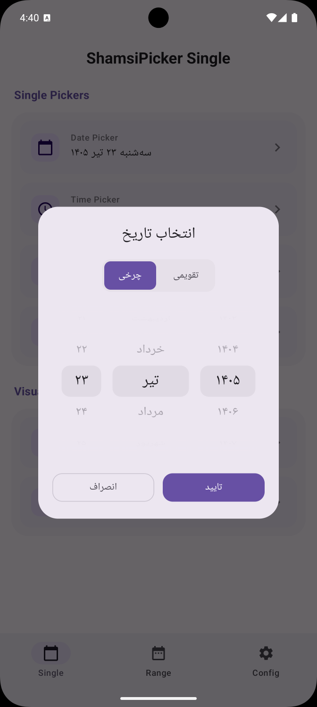
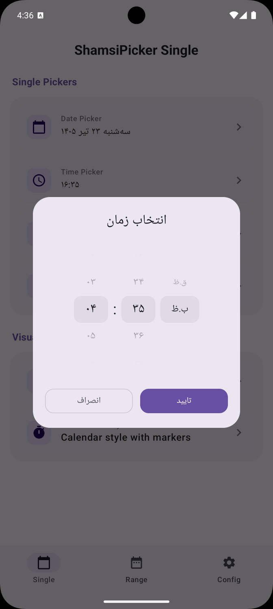
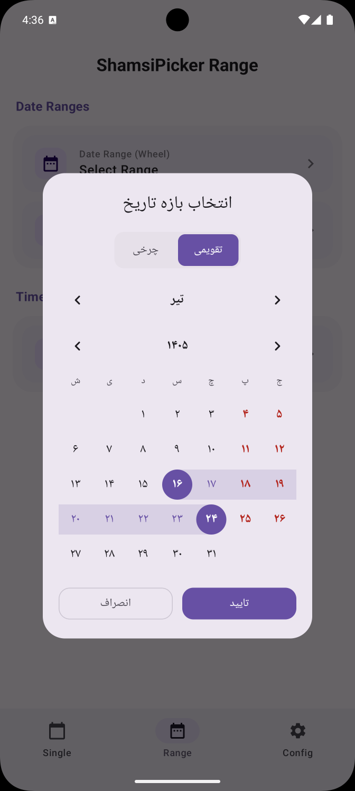
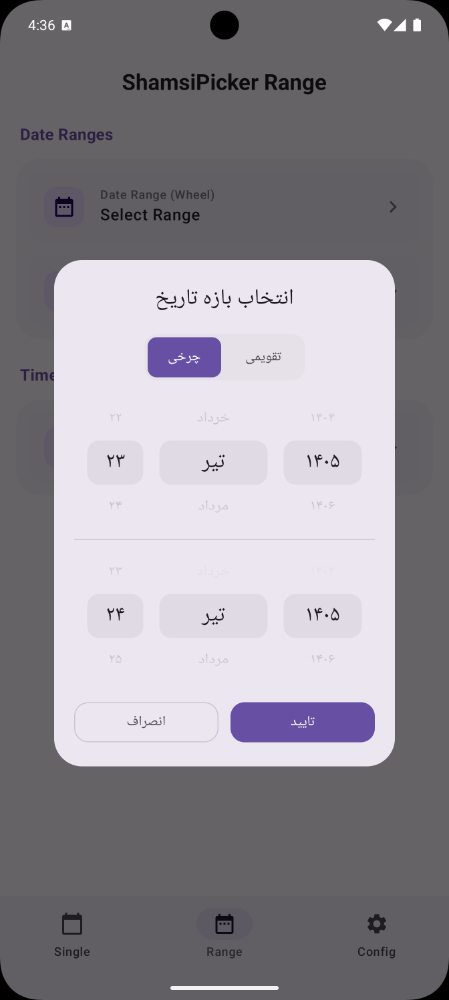
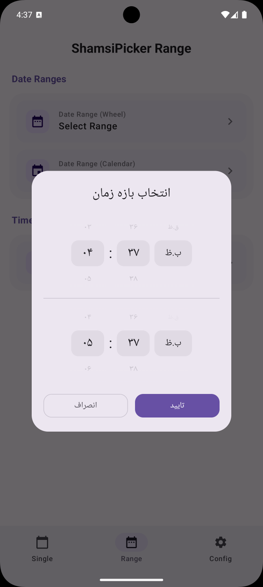
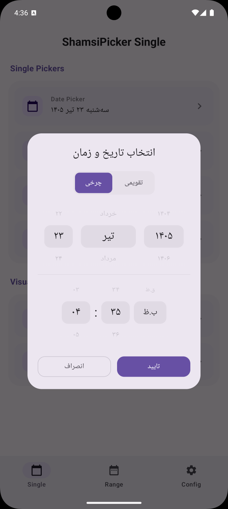
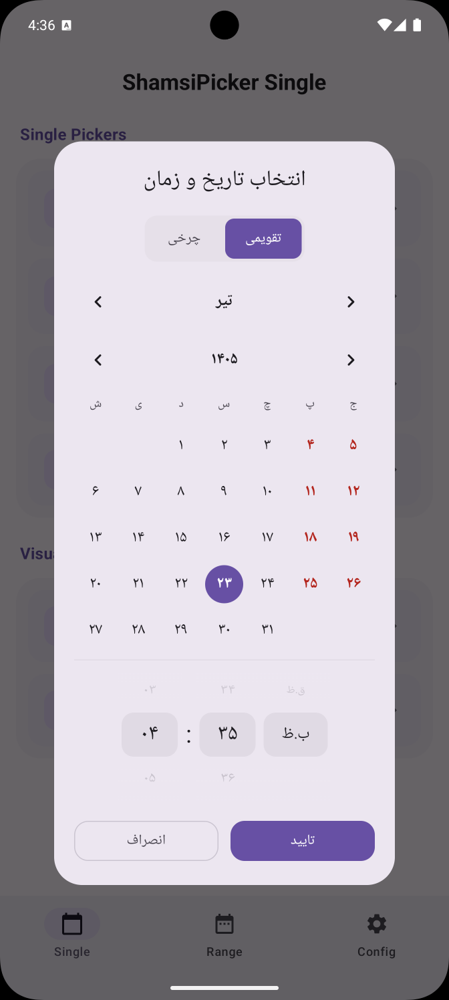
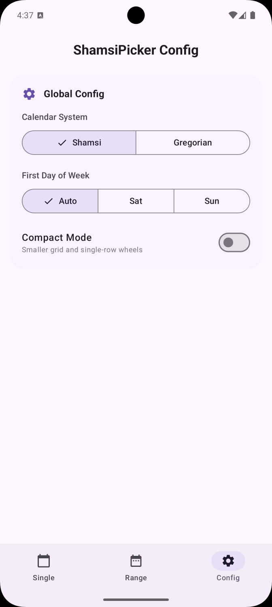

# ShamsiPicker

[](https://github.com/AlirezaJavan/PersianDateTimePicker/actions/workflows/android.yml)
[](https://central.sonatype.com/artifact/io.github.alirezajavan/shamsi-picker)
[](https://central.sonatype.com/artifact/io.github.alirezajavan/shamsi-core)
[](https://android-arsenal.com/api?level=26)
[](LICENSE)

A modern, highly customizable Shamsi (Persian) and Gregorian date and time picker library for Jetpack Compose, built on a pure-Kotlin core.

## Project Structure

This project is split into two modules:

- **`shamsi-core`**: A pure-Kotlin/JVM library containing all date logic, calendar conversions, and formatting. It has **zero Android dependencies** and can be used in JVM, KMP, or non-UI layers.
- **`shamsi-picker`**: The Android library providing **Jetpack Compose** dialogs and UI components. It depends on `shamsi-core`.

## Features

- **Multi-Calendar Support**: Pick between **Shamsi** and **Gregorian** calendars using the same UI components.
- **ShamsiDatePickerDialog**: Supports both Wheel (iOS-style) and Calendar (grid) styles.
- **ShamsiTimePickerDialog**: iOS-style infinite spinning wheel for hours and minutes.
- **ShamsiDateTimePickerDialog**: A unified dialog showing date and time wheels simultaneously for quick selection. Supports both Wheel and Calendar date styles, with an optional compact layout (`compactCalendar`/`compactWheel`) for tighter spacing.
- **ShamsiDateRangePickerDialog**: Pick a from→to date range in Wheel or Calendar style.
- **ShamsiTimeRangePickerDialog**: Pick a from→to time range with two stacked wheel rows.
- **Limit Aware**: Set dynamic boundaries (e.g. `ShamsiDate.Now`) or fixed limits (Gregorian or Shamsi).
- **Localization Aware**: Automatically handles Persian/English month names, weekday names, and numerals (Persian vs Latin digits).
- **Customizable Week Start**: Configure the first day of the week (defaults to Saturday for Shamsi, Sunday for Gregorian).
- **Leap Year Aware**: Automatically handles 29/30 day Esfand and Feb 29.
- **Persian & Latin Formatting**: Built-in formatters for long/short date and time strings.
- **Theming & Text Customization**: Restyle colors, typography (including custom fonts), and re-word the title/buttons/labels of every dialog via `ShamsiPickerColors`, `ShamsiPickerTypography`, and `ShamsiPickerStrings` — no forking required.
- **Weekend Awareness**: The Calendar-style grid — in the date, date+time, and date range pickers — always highlights fixed weekly days off (Thursday/Friday for Shamsi, Saturday/Sunday for Gregorian) — no configuration needed.
- **Holiday / Event Markers**: Mark days with a `CalendarEvent` (label, `CalendarEventType`, optional color) in the Calendar-style grid, via `events` on `ShamsiDatePickerConfig` or `ShamsiDateRangePickerConfig`. `Holiday` events render like a weekend (bold, colored day number); `Event` events show a small colored dot instead. Labels are exposed via `contentDescription` for screen readers.

## Screenshots

|                        Calendar Style                        |                        Wheel Style                        |                        Time Picker                        |
|:------------------------------------------------------------:|:---------------------------------------------------------:|:---------------------------------------------------------:|
|        |        |        |
|                            :---:                             |                           :---:                           |                           :---:                           |
|  |  |  |

|              Date + Time Picker (Wheel)               |              Date + Time Picker (Calendar)               | Config                                           |
|:-------------------------------------------------------:|:------------------------------------------------------------:|--------------------------------------------------|
|  |  |  |

## Installation

Add the following to your `build.gradle.kts`:

### Android (Compose)
```kotlin
dependencies {
    // Includes shamsi-core automatically
    implementation("io.github.alirezajavan:shamsi-picker:1.5.0")
}
```

### JVM / Non-UI
```kotlin
dependencies {
    implementation("io.github.alirezajavan:shamsi-core:1.5.0")
}
```

## Usage (Compose)

All pickers follow the same pattern: pass callbacks and a config object.

### Date Picker

```kotlin
var selectedDate by remember { mutableStateOf(ShamsiDate.Now) }
var showDatePicker by remember { mutableStateOf(false) }

if (showDatePicker) {
    ShamsiDatePickerDialog(
        onConfirm = { date ->
            selectedDate = date
            showDatePicker = false
        },
        onDismiss = { showDatePicker = false },
        config = ShamsiDatePickerConfig(
            initialDate = selectedDate,
            style = ShamsiDatePickerStyle.Calendar, // or .Wheel
            calendarType = CalendarType.Gregorian, // or .Shamsi (default)
        ),
    )
}
```

### Time Picker

```kotlin
var showTimePicker by remember { mutableStateOf(false) }

if (showTimePicker) {
    ShamsiTimePickerDialog(
        onConfirm = { time ->
            selectedDate = selectedDate.copy(hour = time.hour, minute = time.minute)
            showTimePicker = false
        },
        onDismiss = { showTimePicker = false },
        config = ShamsiTimePickerConfig(
            initialTime = selectedDate.toTime(),
        ),
    )
}
```

### Date + Time Picker

```kotlin
var showDateTimePicker by remember { mutableStateOf(false) }

if (showDateTimePicker) {
    ShamsiDateTimePickerDialog(
        onConfirm = { dateTime ->
            selectedDate = dateTime
            showDateTimePicker = false
        },
        onDismiss = { showDateTimePicker = false },
        config = ShamsiDateTimePickerConfig(
            initialDateTime = selectedDate,
            style = ShamsiDatePickerStyle.Wheel, // or .Calendar — a compact grid shown above the time wheel
            calendarType = CalendarType.Shamsi,
        ),
    )
}
```

### Date Range Picker

```kotlin
var selectedDateRange by remember { mutableStateOf<ShamsiDateRange?>(null) }
var showDateRangePicker by remember { mutableStateOf(false) }

if (showDateRangePicker) {
    ShamsiDateRangePickerDialog(
        onConfirm = { range ->
            selectedDateRange = range
            showDateRangePicker = false
        },
        onDismiss = { showDateRangePicker = false },
        config = ShamsiDateRangePickerConfig(
            style = ShamsiDatePickerStyle.Calendar, // or .Wheel
            // events = listOf(...) — same CalendarEvent markers as ShamsiDatePickerConfig
        ),
    )
}
```

### Time Range Picker

```kotlin
var selectedTimeRange by remember { mutableStateOf<ShamsiTimeRange?>(null) }
var showTimeRangePicker by remember { mutableStateOf(false) }

if (showTimeRangePicker) {
    ShamsiTimeRangePickerDialog(
        onConfirm = { range ->
            selectedTimeRange = range
            showTimeRangePicker = false
        },
        onDismiss = { showTimeRangePicker = false },
        config = ShamsiTimeRangePickerConfig(
            initialFrom = ShamsiTime(9, 0),
            initialTo = ShamsiTime(17, 0),
        ),
    )
}
```

---

## Configuration

### How date and time values work

Every date or time field in a config object accepts a **limit type** — a sealed interface that can hold one of three kinds of values:

| What you want | Date (`ShamsiDateLimit`) | Time (`ShamsiTimeLimit`) |
|---|---|---|
| Fixed Shamsi value | `ShamsiDate(1403, 6, 15)` | `ShamsiTime(8, 30)` |
| Current date/time (dynamic) | `ShamsiDate.Now` or `ShamsiDateLimit.Now` | `ShamsiTime.Now` or `ShamsiTimeLimit.Now` |
| Fixed Gregorian value | `LocalDate.of(2024, 9, 5).asLimit()` | `LocalTime.of(8, 30).asLimit()` |
| Fixed Gregorian (DateTime) | `LocalDateTime.of(2024, 9, 5, 10, 30).asLimit()` | - |
| Current Gregorian (dynamic) | `LocalDate.now().asLimit()` | `LocalTime.now().asLimit()` |
| Current Gregorian (DateTime) | `LocalDateTime.now().asLimit()` | - |

Dynamic values (`Now`) are resolved **once when the dialog opens**, not on every recomposition.

### Compact layouts

Every config below (`ShamsiDatePickerConfig`, `ShamsiTimePickerConfig`,
`ShamsiDateTimePickerConfig`, `ShamsiDateRangePickerConfig`,
`ShamsiTimeRangePickerConfig`) accepts one or both of:

- **`compactCalendar: Boolean`** (date configs only) — shrinks the Calendar-style
  grid (smaller day cells, tighter spacing).
- **`compactWheel: Boolean`** — collapses each Wheel-style row to just the
  selected value, with no dimmed rows above/below.

Both default to `false`, so nothing changes unless you opt in — independent of
`calendarType` (Shamsi or Gregorian) and applied uniformly across simple and
range pickers:

```kotlin
ShamsiDateTimePickerConfig(
    style = ShamsiDatePickerStyle.Calendar,
    compactCalendar = true,
    compactWheel = true,
)
```

---

### `ShamsiDatePickerConfig`

```kotlin
ShamsiDatePickerConfig(
    initialDate: ShamsiDateLimit = ShamsiDate.Now,
    minDate: ShamsiDateLimit? = null,    // no lower bound if omitted
    maxDate: ShamsiDateLimit? = null,    // no upper bound if omitted
    style: ShamsiDatePickerStyle = ShamsiDatePickerStyle.Wheel,
    calendarType: CalendarType = CalendarType.Shamsi,
    firstDayOfWeek: DayOfWeek? = null,   // null = use calendar system default
    compactCalendar: Boolean = false,    // shrink the Calendar-style grid
    compactWheel: Boolean = false,       // show only the selected row of the Wheel-style picker
    events: List<CalendarEvent> = emptyList(), // holiday/event markers (Calendar style only)
)
```

#### Examples

```kotlin
// Open on today, no bounds
ShamsiDatePickerConfig()

// Fixed Shamsi initial date
ShamsiDatePickerConfig(
    initialDate = ShamsiDate(1403, 1, 1),
    style = ShamsiDatePickerStyle.Calendar,
)

// Compact Calendar grid, e.g. embedded next to other controls
ShamsiDatePickerConfig(
    style = ShamsiDatePickerStyle.Calendar,
    compactCalendar = true,
)

// Calendar style with holiday/event markers
ShamsiDatePickerConfig(
    style = ShamsiDatePickerStyle.Calendar,
    events = listOf(
        // Holiday: bold, colored day number — same visual weight as a weekend
        CalendarEvent(date = ShamsiDate(1403, 1, 1), label = "Nowruz", type = CalendarEventType.Holiday),
        CalendarEvent(
            date = ShamsiDate(1403, 1, 13),
            label = "Sizdah Be-dar",
            type = CalendarEventType.Holiday,
            colorArgb = 0xFF43A047.toInt(),
        ),
        // Event: a small colored dot under the day number, not a day off
        CalendarEvent(date = ShamsiDate(1403, 3, 14), label = "App Reminder", type = CalendarEventType.Event),
    ),
)

// Compact Wheel — single row per field, no dimmed rows above/below
ShamsiDatePickerConfig(
    style = ShamsiDatePickerStyle.Wheel,
    compactWheel = true,
)

// Gregorian initial date with a "today onwards" lower bound
ShamsiDatePickerConfig(
    initialDate = LocalDate.of(2025, 3, 21).asLimit(),
    minDate = ShamsiDate.Now,
)
```

---

### `ShamsiTimePickerConfig`

```kotlin
ShamsiTimePickerConfig(
    initialTime: ShamsiTimeLimit = ShamsiTime.Now,
    minTime: ShamsiTimeLimit? = null,   // no lower bound if omitted
    maxTime: ShamsiTimeLimit? = null,   // no upper bound if omitted
    calendarType: CalendarType = CalendarType.Shamsi,
    compactWheel: Boolean = false,      // show only the selected row of each wheel
)
```

#### Examples

```kotlin
// Business hours: 08:30 → 17:00
ShamsiTimePickerConfig(
    initialTime = ShamsiTime(9, 0),
    minTime = ShamsiTime(8, 30),
    maxTime = ShamsiTime(17, 0),
)

// "Until now" — user can only pick a past time
ShamsiTimePickerConfig(
    maxTime = ShamsiTimeLimit.Now,
)
```

---

### `ShamsiDateTimePickerConfig`

```kotlin
ShamsiDateTimePickerConfig(
    initialDateTime: ShamsiDateLimit = ShamsiDate.Now,
    minDateTime: ShamsiDateLimit? = null,
    maxDateTime: ShamsiDateLimit? = null,
    style: ShamsiDatePickerStyle = ShamsiDatePickerStyle.Wheel,
    calendarType: CalendarType = CalendarType.Shamsi,
    firstDayOfWeek: DayOfWeek? = null,
    compactCalendar: Boolean = false,    // shrink the Calendar-style grid so it fits above the time wheel
    compactWheel: Boolean = false,       // show only the selected row of each date/time wheel
)
```

---

## Theming

Every dialog (`ShamsiDatePickerDialog`, `ShamsiDateTimePickerDialog`,
`ShamsiDateRangePickerDialog`, `ShamsiTimePickerDialog`,
`ShamsiTimeRangePickerDialog`) accepts three optional
parameters — `colors`, `typography`, and `strings` — alongside `config`. Each
defaults to the current `MaterialTheme` / localized resources, so existing call
sites keep working unchanged.

```kotlin
import io.github.alirezajavan.shamsipicker.ui.theme.ShamsiPickerDefaults

ShamsiDatePickerDialog(
    onConfirm = { /* ... */ },
    onDismiss = { /* ... */ },
    colors =
        ShamsiPickerDefaults.colors(
            accentColor = Color(0xFF6750A4),
            onAccentColor = Color.White,
            titleColor = Color(0xFF6750A4),
        ),
    typography =
        ShamsiPickerDefaults.typography().let { defaults ->
            defaults.copy(titleStyle = defaults.titleStyle.copy(fontFamily = FontFamily.Serif))
        },
    strings =
        ShamsiPickerDefaults.dateStrings(
            title = "Pick a day",
            confirmText = "Done",
            cancelText = "Nevermind",
        ),
)
```

- **`ShamsiPickerColors`** — text/accent/dialog/button colors. Build one with
  `ShamsiPickerDefaults.colors(...)`, overriding only what you need.
- **`ShamsiPickerTypography`** — a `TextStyle` per role (title, wheel item, day
  cell, weekday label, nav header, etc.). Set a custom font by putting a
  `FontFamily` on the style you pass in — there's no separate "font" parameter.
- **`ShamsiPickerStrings`** — one data class per dialog
  (`ShamsiDatePickerStrings`, `ShamsiDateTimePickerStrings`,
  `ShamsiDateRangePickerStrings`, `ShamsiTimePickerStrings`,
  `ShamsiTimeRangePickerStrings`) covering the title, confirm/cancel button
  text, and dialog-specific labels (like AM/PM). Pass one explicitly to set
  English text on a Shamsi-calendar picker, or vice versa — a custom instance
  always wins regardless of `calendarType` or device locale. The **default**
  instance (built by `ShamsiPickerDefaults.dateStrings()` etc.) follows the
  picker's `calendarType` instead of the device's system locale, so a Shamsi
  picker shows Persian labels (e.g. `ق.ظ`/`ب.ظ` for AM/PM) even on an
  English-language device, and a Gregorian picker shows English labels even on
  a Persian-language device.

See the sample app's "Theming" section for a live default-vs-custom comparison.

---

## Core API

### Formatting

```kotlin
import io.github.alirezajavan.shamsipicker.format.DateFormatter
import io.github.alirezajavan.shamsipicker.calendar.CalendarType

// Shamsi
val shamsiLong = DateFormatter.long(date, CalendarType.Shamsi)           // چهارشنبه ۱ فروردین ۱۴۰۳
val shamsiLongTime = DateFormatter.longWithTime(date, CalendarType.Shamsi) // چهارشنبه ۱ فروردین ۱۴۰۳ ساعت ۱۳:۴۵

// Gregorian
val gregLong = DateFormatter.long(date, CalendarType.Gregorian)         // Wed, March 20, 2024
val gregLongTime = DateFormatter.longWithTime(date, CalendarType.Gregorian) // Wed, March 20, 2024 at 13:45
```

### Date Conversion

Easily convert between Gregorian `java.time.LocalDate` and `ShamsiDate`.

```kotlin
import io.github.alirezajavan.shamsipicker.calendar.ShamsiCalendar

// Gregorian to Shamsi
val shamsi = ShamsiCalendar.fromGregorian(LocalDate.now())

// Shamsi to Gregorian
val gregorian = ShamsiCalendar.toGregorian(shamsi)
```

## License

Apache License 2.0
